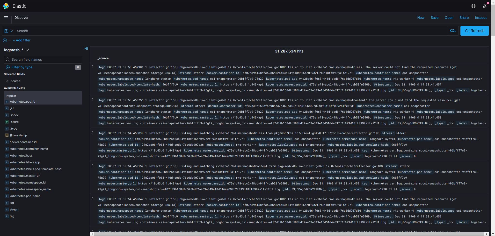

# Bitnami Elasticsearch, Kibana, and FluentD

This directory will install ElasticSearch, Kibana, and FluentD.

The full stack will ensure that ElasticSearch is up, that Kibana is available to view and visualize your logs, and FluentD will ensure that all logs from your cluster are sent to Elastic/Kibana.

