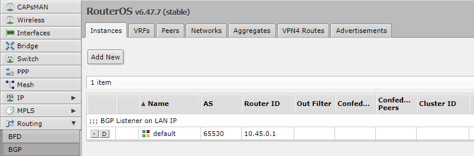
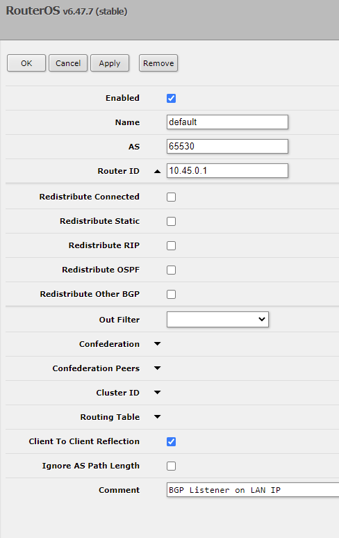
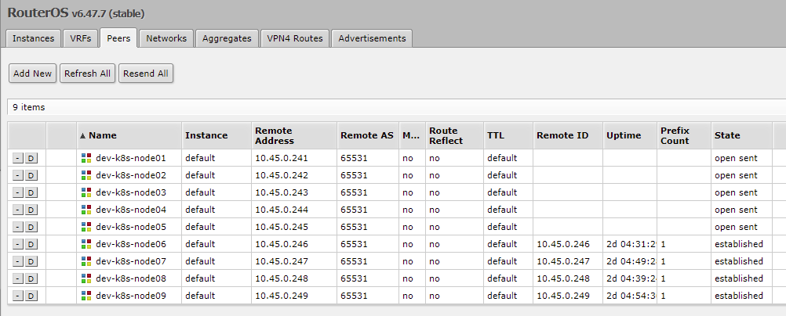
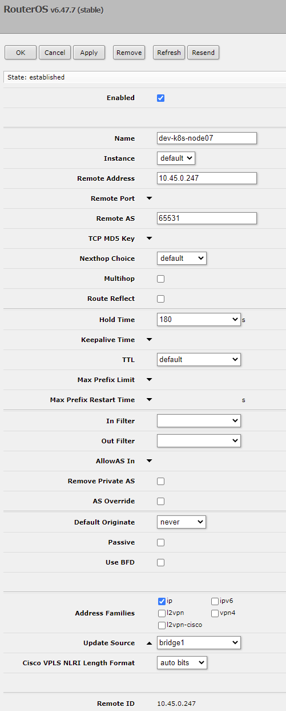
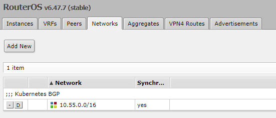
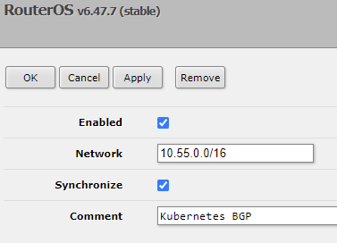

# MetalLB

This configMap should provide a working example.

## Mikrotik Screenshots

If you want to see what this setup looks like when functioning with a Mikrotik RouterOS Router, see the screenshots below.

### Routing > BGP > Interfaces

### Routing > BGP > Interfaces > Settings

### Routing > BGP > Peers

### Routing > BGP > Peers > Settings

### Routing > BGP > Networks

### Routing > BGP > Networks > Settings

